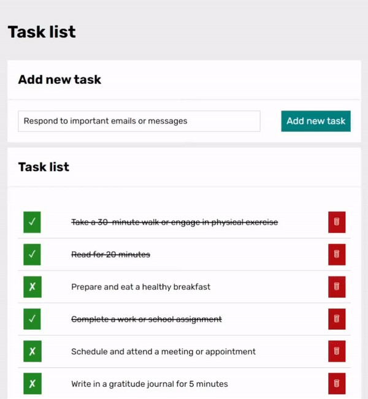
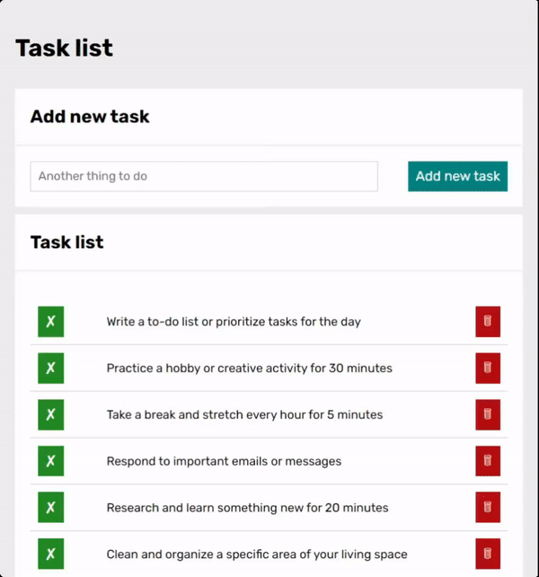

# To-do List

[Demo] https://aknop07.github.io/to-do-list/

The To-do List web app is a user-friendly and responsive application that helps you manage your tasks efficiently. With its clean and intuitive interface, it allows you to easily add, track, and remove tasks.

$~$

## Design and Layout:
Upon opening the app, you're presented with a sleek and organized layout. The use of HTML, CSS, and Grid/Flex/MediaQueries techniques ensures that the app adapts seamlessly to different screen sizes, making it accessible on desktops, laptops, tablets and mobile devices.

$~$

## How to use:
To add a new task, simply use the designated input field and click the "Add new task" button. Your task will instantly appear in the list, neatly displayed in a visually pleasing format. Each task is accompanied by a checkbox on the left side, which you can use to mark a task as finished. When a task is completed, it is visually distinguished with a line-through style and a tick icon, providing a satisfying sense of accomplishment.

Should you decide to remove a task, a convenient "Remove" button is available next to each task. Clicking this button removes the task from the list, keeping your workspace clutter-free and organized.

$~$

## Used in this project:
- HTML
- CSS with BEM convention
- Grid
- Flexbox
- MediaQueries
- JavaScript

$~$

## Try it out!
Overall, the Task List web app is a powerful tool for anyone seeking a convenient and visually appealing way to manage their tasks. Its responsive design, intuitive interface, and essential features make it a valuable addition to your productivity toolkit.
